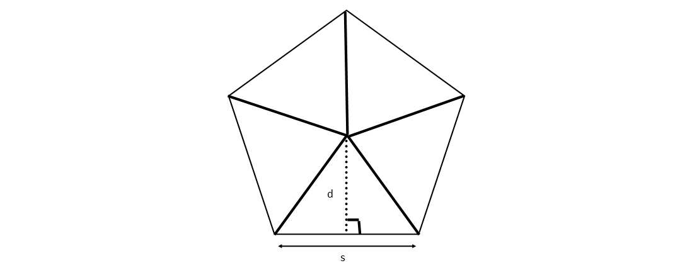

We have previously discovered that the area of a parallelogram can be represented as the absolute value of a determinant. Here we will investigate further links between determinants and areas.

  

#Properties of Area

1. It is non negative.
2. It is additive.
3. It is invariant under translations.
4. It is zero in one-dimension.

Properties 1. and 2. are very general. Area can not be negative as this is impossible. Area is also definitely additive as this property has been used multiple times in working out the area of complex irregular polygons by breaking up a larger complex shape into smaller simpler shapes and summing the area of the smaller shapes and form the basis for formulas of finding areas of shapes for example The area of a regular polygon using the apothem. The formula for the area of regular polygon is $$a = \frac{1}{2}pd$$ where $p$ is the perimeter and $d$ is the apothem. 

This formula originates from splitting the polygon into $n$ congruent triangles, as shown in Figure 4. Then calculating the area of one of the triangles using the usual formula $a_T = \frac{1}{2}bh$, here $h$ is the same as the apothem and $b$ is the same as the length of a side. Then the area is the sum of all the triangles which is worked out by multiplying by the amount of congruent triangles $n$. This gives $$a = \frac{1}{2}nsd.$$ Doing the number of sides multiplied by the length of the side is the same as finding the perimeter of the shape, so substituting $p = ns$ gives $$a = \frac{1}{2}pd.$$

Property 3. must be true as translations only affect the position of the shape and does not alter the size of the shape in any way and therefore should not have any affect on the area. This property is consistent with a property of determinants, as adding a constant to a matrix does not have any effect on the determinant of the matrix.

Property 4. follows from in one-dimension only lines can be formed which have no area. This property is similar to the property in which if a matrix has any two rows or columns which are identical, the determinant is zero.

#Properties of the area of a parallelogram

Take a parallelogram ($P$) with sides of **$a$** and **$b$** $P$(**$a$**,**$b$**) as shown in Figure 1. Let the area of the parallelogram be a function of **$a$** and **$b$**, area of $P$(**$a$**,**$b$**).

   

  

We can see that in Figures 2 and 3 when one of the sides is multiplied by a constant $n$ the parallelogram just gets $n$ amount of parallelograms attached on the end. So by the additvity property 2. the area of the parallelogram is just multiplied by $n$. Therefore, the area of $P$($n$**$a$**,**$b$**) = the area of $P$(**$a$**,$n$**$b$**) = $|n|$$P$(**$a$**,**$b$**), where $n$ is an constant. 
This coincides with the property of determinants in which scaling a row or column of a matrix by a $n$ causes the determinant to be multiplied by $n$: $$\begin{vmatrix}a_1 + nb_1&b_1\\a_2 + nb_2&b_2\end{vmatrix} =  \begin{vmatrix}a_1&b_1\\a_2&b_2\end{vmatrix}.$$

  

In Figures 4 and 5, we can see that the two yellow areas are equal and the two pink areas are equal. This shows is that if we add a multiple of a side to the other side the area just remains the same. Thus, the area of $P$(**$a$**,**$b$**$+ n$**$a$**) = the area of $P$(**$a$**$+ n$**$b$**,**$b$**) = $P$(**$a$**,**$b$**), where $n$ is a constant.
This follows with the property of determinants in which when the elements of any row (or column) being multiplied by a $n$ (a constant) are added to the corresponding elements of the other row (or column), then the determinant is unchanged: $$\begin{vmatrix}na_1&nb_1\\a_2&b_2\end{vmatrix} = \begin{vmatrix}na_1&b_1\\na_2&b_2\end{vmatrix} = k \begin{vmatrix}a_1&b_1\\a_2&b_2\end{vmatrix}.$$

#Bibliography

* http://images3.wikia.nocookie.net/nccmn/ro/images/d/d5/Determinants%2C_Areas_and_Volumes.pdf

* https://en.wikipedia.org/wiki/Determinant

* https://www.math24.net/properties-determinants/